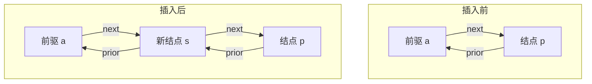
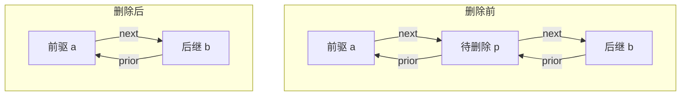

[数据结构.md](https://github.com/user-attachments/files/32590868/default.md)
# 数据结构

## 一、时间复杂度与空间复杂度

### 1. 为什么分析复杂度

算法的实际运行时间会受到编程语言、编译器和硬件影响。为了比较算法本身，通常把**输入规模**记作 $n$，选取一种关键操作（基本操作），观察它的执行次数或额外存储量如何随 $n$ 增长。这是“事前分析估算”；实际运行并计时属于“事后统计”。

复杂度描述的是**规模增长时的趋势**，不是某次运行的秒数或字节数。分析前要说明 $n$ 代表什么、统计哪种操作，以及讨论最好、平均还是最坏情况。

### 2. 时间复杂度

时间复杂度描述基本操作执行次数随输入规模增长的量级，常写成 $T(n)=O(f(n))$。严格地说， $T(n)=O(f(n))$ 表示存在正常数 $c$、 $n_0$，使得任意 $n\ge n_0$ 都有 $T(n)\le c f(n)$。因此，大 $O$ 给出**渐近上界**；若还要表达精确的渐近量级，可写 $T(n)=\Theta(f(n))$。日常题目中说“时间复杂度为 $O(f(n))$”，通常指选用尽可能紧的常见上界。

#### 大 $O$ 的推导

1. 确定 $n$ 和需要统计的基本操作。
2. 写出操作执行次数关于 $n$ 的函数。
3. 去掉低阶项与常数系数，保留增长最快的项。例如 $3n^2+2n+7=O(n^2)$。
4. 对循环，先看循环次数，再乘以每次循环体的代价；顺序执行的代码把代价相加。

用 $2n+3$ 与 $3n+1$ 说明：常数项与系数会影响具体运行次数，但分析渐近量级时二者都属于 $O(n)$。**同属 $O(n)$ 不表示实际运行时间完全一样。**

#### 四个基本例子

| 代码特征 | 次数分析 | 时间复杂度 |
| --- | --- | --- |
| 用公式 `sum = n * (n + 1) / 2` 求和 | 固定次数的算术与赋值 | $O(1)$ |
| `for (int i = 0; i < n; ++i)`，循环体为常数时间 | 循环体执行 $n$ 次 | $O(n)$ |
| `count = 1; while (count < n) count *= 2;` | 执行 $k$ 次后 `count = 2^k`，约需 $\lceil\log_2 n\rceil$ 次 | $O(\log n)$ |
| 两层各执行 $n$ 次的嵌套循环 | 循环体执行 $n\times n$ 次 | $O(n^2)$ |

```c
// 每次内层循环都是常数时间；总执行次数为 n^2
for (int i = 0; i < n; ++i) {
    for (int j = 0; j < n; ++j) {
        /* 一次基本操作 */
    }
}
```

> [!TIP]
> **看循环次数，而不是只数循环层数**
> 内层若只运行到 `i`，总次数为 $0+1+\cdots+(n-1)=n(n-1)/2$，仍为 $O(n^2)$。若外层运行 $\log n$ 次、内层运行 $n$ 次，则为 $O(n\log n)$。

#### 常见增长顺序

当 $n$ 足够大时，下列**函数**从增长慢到快排列：

$$1<\log n<n<n\log n<n^2<n^3<2^n<n!<n^n.$$

对应的复杂度类别依次是 $O(1)$、 $O(\log n)$、 $O(n)$、 $O(n\log n)$、 $O(n^2)$、 $O(n^3)$、 $O(2^n)$、 $O(n!)$、 $O(n^n)$。这里的“小于”比较的是代表函数的**增长速度**，不是说两个大 $O$ 集合可以直接按数值比较。对数的底数若为大于 1 的常数，只会改变常数系数，故通常统一写作 $O(\log n)$。

#### 最好、平均、最坏情况

以长度为 $n$ 的数组顺序查找目标值为例：

| 情况 | 比较次数 | 时间复杂度 |
| --- | --- | --- |
| 最好：首元素命中 | $1$ | $O(1)$ |
| 最坏：末元素命中或查找失败 | $n$ | $O(n)$ |
| 平均：假设目标一定存在且等概率处于任一位置 | $(n+1)/2$ | $O(n)$ |

没有给出输入分布时，不能仅凭“平均”二字确定精确次数。若题目未特别说明，通常先给出**最坏情况**的时间复杂度。

### 3. 空间复杂度

空间复杂度描述算法运行时所需存储空间随输入规模的增长，常写作 $S(n)=O(f(n))$。课件把存储量分为输入数据、程序本身和辅助变量；分析题通常统计**算法额外使用的辅助空间**，不计已经给定的输入数据。要说明口径：若算法自己新建数组或其他结构，应把它计入；递归调用产生的调用栈也要计入。

| 使用方式                           | 额外空间复杂度 | 原因                              |
| ------------------------------ | ------- | ------------------------------- |
| 固定数量的标量变量，如 `int a, i`         | $O(1)$  | 变量个数不随 $n$ 增长                   |
| 新建长度为 $n$ 的数组 `a[n]`           | $O(n)$  | 存储 $n$ 个元素                      |
| 新建 $n\times m$ 的二维数组 `a[n][m]` | $O(nm)$ | 存储 $nm$ 个元素；若 $m=n$，则为 $O(n^2)$ |
| 递归深度为 $n$，每层只用固定空间             | $O(n)$  | 同时存在约 $n$ 个调用栈帧                 |

**输入与新建空间要分开看。**例如对调用者传入的 `a[n]` 原地遍历，若只使用下标和临时变量，额外空间是 $O(1)$；若函数内部再申请长度为 $n$ 的 `b[n]`，额外空间就是 $O(n)$。函数调用通常会占用栈帧，但不能仅凭“调用了函数”判定为 $O(n)$；关键是**同时存在多少层调用**。

```c
int fact(int n) {
    if (n <= 1) return 1;
    return n * fact(n - 1);
}
```

上例递归深度为 $n$，每层做常数次操作：时间复杂度 $O(n)$，额外空间复杂度 $O(n)$（调用栈）。它也说明时间复杂度和空间复杂度需要**分别分析**。

> [!NOTE]
> **数据结构中的“结构”与空间复杂度**
> 逻辑结构与存储结构：线性、树形、图状描述数据元素之间的**逻辑关系**；顺序存储、链式存储描述元素在内存中的**存放方式**。选择不同存储方式会影响额外空间，例如链式存储通常需要保存指针。这里的“存储结构”是数据的组织方式，“空间复杂度”是空间用量随规模增长的量级。

### 4. 练习

| 代码特征（PPT 第 101–102 页） | 推导 | 时间复杂度 | 额外空间复杂度 |
| --- | --- | --- | --- |
| `y=0; while (n >= (y+1)*(y+1)) y++;` | 停止时 $y$ 约为 $\sqrt n$ | $O(\sqrt n)$ | $O(1)$ |
| `i=1; while (i<=n) i*=3;` | 第 $k$ 次后 $i=3^k$ | $O(\log n)$ | $O(1)$ |
| 外层 `k*=2`，内层从 `1` 到 `n` | $O(\log n)$ 轮，每轮 $O(n)$ | $O(n\log n)$ | $O(1)$ |
| 递归阶乘 `fact(n-1)` | 递归深度 $n$ | $O(n)$ | $O(n)$ |

### 5. 做题时的检查清单

1. 明确规模变量：是数组长度 $n$，还是矩阵的行数 $n$ 与列数 $m$？
2. 先算执行次数或新增元素数量，再写大 $O$；不要把公式中的 $n$ 直接当作循环次数。
3. 嵌套循环看各层实际执行范围；连续循环的代价相加。
4. 区分输入数据与新增辅助空间，并检查递归的最大调用深度。
5. 输入内容会影响执行次数时，交代最好、平均或最坏情况及平均情况的假设。

## 二、线性表

### 1. 线性表是什么

线性表是由 $n\;(n\ge 0)$ 个**同类型**数据元素组成的有限序列，记作 $L=(a_1,a_2,\ldots,a_n)$。 $n=0$ 时为空表。除首元素外，每个元素都有唯一的直接前驱；除尾元素外，每个元素都有唯一的直接后继。这里的“同类型”指元素的结构相同：一个元素可以是整数，也可以是一条包含学号、姓名等字段的记录。

线性表是**逻辑结构**，只规定元素的先后关系。顺序表和链表是它的两种**存储实现**。基本操作包括初始化、求长度、按位置取值、按值查找、插入、删除、清空与销毁。

> [!IMPORTANT]
> **全章位置约定**
> **逻辑位序从 1 开始，数组下标从 0 开始。**第 $i$ 个元素存放在顺序表的 `data[i - 1]`；长度为 $n$ 的表允许在 $1\sim n+1$ 位插入，只允许删除 $1\sim n$ 位。按值查找返回 `0` 表示未找到，因为合法位序不会是 `0`。

### 2. 顺序表：元素连续存放

顺序表用一段连续空间存储元素，逻辑上相邻的元素在内存中也相邻。`length` 是**已有元素个数**，`capacity` 是**已分配的最大元素个数**，始终满足 $0\le\text{length}\le\text{capacity}$。第 $i$ 个元素的地址可直接由起始地址和元素大小算出，因此按位取值为 $O(1)$；按值查找仍要逐个比较，最坏为 $O(n)$。

下面用 C++ 描述动态顺序表，元素类型先设为 `int`；若改成图书等记录，只需替换 `ElemType` 并明确按哪个字段比较。代码片段共用以下定义。

（动态顺序表的解释：实际上是一开始new了固定的capacity个elemtype的内存，然后用elemtype* data指向首地址，用length记录已用长度。用满capacity后再申请新内存，复制元素，释放旧内存，此处在代码后有详细解释。故曰：动态。）

```cpp
#include <new>
#include <iostream>
using ElemType = int;

struct SqList {
    ElemType* data = nullptr;
    int length = 0;
    int capacity = 0;
};

bool reserve(SqList& L, int need) {
    if (need <= L.capacity) return true;
    int newCapacity = L.capacity == 0 ? 4 : L.capacity;
    while (newCapacity < need) newCapacity *= 2;
    ElemType* newData = new (std::nothrow) ElemType[newCapacity];
    if (newData == nullptr) return false;
    for (int j = 0; j < L.length; ++j) newData[j] = L.data[j];
    delete[] L.data;
    L.data = newData;
    L.capacity = newCapacity;
    return true;
}

void destroy(SqList& L) {
    delete[] L.data;
    L.data = nullptr;
    L.length = L.capacity = 0;
}
```

扩容时，**先分配新空间，再复制旧元素，最后释放旧空间**；若先释放，旧元素就无法复制了。`delete[]` 必须与 `new[]` 配对。`length = 0` 只是清空逻辑内容，并不释放已申请的数组。由于这里手动管理 `data`，不要直接复制整个 `SqList`：那只会复制指针，可能导致两个表重复释放同一数组。

#### 按位取值、按值查找、插入和删除

```cpp
bool getElem(const SqList& L, int i, ElemType& e) {
    if (i < 1 || i > L.length) return false;
    e = L.data[i - 1];
    return true;
}

int locateElem(const SqList& L, ElemType e) {
    for (int j = 0; j < L.length; ++j)
        if (L.data[j] == e) return j + 1;
    return 0;
}

bool insertSq(SqList& L, int i, ElemType e) {
    if (i < 1 || i > L.length + 1) return false;
    if (!reserve(L, L.length + 1)) return false;
    for (int j = L.length - 1; j >= i - 1; --j)
        L.data[j + 1] = L.data[j];
    L.data[i - 1] = e;
    ++L.length;
    return true;
}

bool deleteSq(SqList& L, int i, ElemType& e) {
    if (i < 1 || i > L.length) return false;
    e = L.data[i - 1];
    for (int j = i; j < L.length; ++j)
        L.data[j - 1] = L.data[j];
    --L.length;
    return true;
}
```

**插入为什么从右往左移动？**以 `[10,20,30,40]` 的第 2 位插入 `15` 为例，原下标 1～3 的元素要后移。先将 `40` 放到下标 4，再移动 `30`、`20`，最后把 `15` 放到下标 1。若从左往右移动，刚写入的 `20` 会覆盖原来的 `30`。第 $i$ 位插入时，移动 $n-i+1$ 个元素；若预留空间够用，尾插不用移动。

**删除为什么从左往右移动？**删除第 2 位 `20` 后，依次用 `30` 覆盖它、用 `40` 覆盖原 `30`，再令 `length` 减 1。第 $i$ 位删除时，移动 $n-i$ 个元素。尾部的旧值可能还留在数组里，但它已不属于长度为 `length` 的表，无需专门清零。

| 操作 | 最好 | 最坏 | 关键原因 |
| --- | --- | --- | --- |
| 按位取值 | $O(1)$ | $O(1)$ | 地址可直接计算 |
| 按值查找 | $O(1)$ | $O(n)$ | 可能要比较整个表 |
| 插入 | $O(1)$ | $O(n)$ | 可能移动元素或扩容复制 |
| 删除 | $O(1)$ | $O(n)$ | 可能移动后续元素 |

若使用倍增容量，连续**尾插**的均摊时间为 $O(1)$，但发生扩容的单次尾插仍可能为 $O(n)$。普通顺序表的存储空间为 $O(n)$；上述操作除扩容外只用 $O(1)$ 辅助空间，扩容瞬间还要暂存新数组。

### 3. 单链表：通过指针连接元素

单链表的每个结点含数据域 `data` 和后继指针 `next`，结点可以分散存放。这里统一使用**带头结点**的写法：`head` 指向不存有效数据的头结点，首个数据结点是 `head->next`，空表满足 `head->next == nullptr`。头结点让“在第 1 位插入”和其他位置遵循同一套找前驱、改指针的步骤。

```cpp
struct Node {
    ElemType data;
    Node* next;
};

Node* makeList() { return new Node{0, nullptr}; }

void destroyList(Node*& head) {
    while (head != nullptr) {
        Node* old = head;
        head = head->next;  // 删除前先保存通向后续结点的路径
        delete old;
    }
}

// i=0 返回头结点；i>=1 返回第 i 个数据结点。
Node* nodeAt(Node* head, int i) {
    if (i < 0) return nullptr;
    Node* p = head;
    for (int j = 0; j < i && p != nullptr; ++j) p = p->next;
    return p;
}

bool insertList(Node* head, int i, ElemType e) {
    if (i < 1) return false;
    Node* pre = nodeAt(head, i - 1);
    if (pre == nullptr) return false;
    Node* s = new Node{e, pre->next};
    pre->next = s;
    return true;
}

bool deleteList(Node* head, int i, ElemType& e) {
    if (i < 1) return false;
    Node* pre = nodeAt(head, i - 1);
    if (pre == nullptr || pre->next == nullptr) return false;
    Node* victim = pre->next;
    e = victim->data;
    pre->next = victim->next;
    delete victim;
    return true;
}
```

`Node* p` 是保存地址的**指针变量**，`*p` 才是地址处的**结点**；`p->data` 等价于 `(*p).data`。访问 `p->next->data` 前必须确认 `p` 和 `p->next` 都非空。遍历时写 `p = p->next` 是让指针转向下一个结点，不是在移动结点本身。

> [!TIP]
> **插入和删除时看清每个指针指向谁**
> 在 `A -> B` 中插入 `S`：先令 `S->next = A->next`，保存通向 `B` 的路径；再令 `A->next = S`。若反过来操作，`A->next` 已指向 `S`，原 `B` 的地址就可能丢失。删除 `B` 时先用 `victim` 保存它，再让 `A->next` 绕过它，最后 `delete victim`。释放后不能继续访问 `victim->next`。

`nodeAt(head, i - 1)` 的含义是找**待操作位置的前驱**：第 1 位的前驱正是头结点。若已知前驱结点的指针，插入或删除只需改几个指针，是 $O(1)$；若只给出位序 $i$，还得从头走到前驱，整体最坏为 $O(n)$。单链表也无法像数组那样直接跳到第 $i$ 个结点，按位取值与按值查找最坏均为 $O(n)$。

#### 头插法与尾插法

头插每次把新结点放在头结点之后，**按输入顺序读取会得到逆序链表**；若要保留输入顺序，可从数组末尾向前读取。尾插维护 `tail` 指向当前末结点，读入一个就接到末尾，因而保持输入顺序。

```cpp
Node* buildByHeadInsert(const ElemType a[], int n) {
    Node* head = makeList();
    for (int i = 0; i < n; ++i) {
        Node* s = new Node{a[i], head->next};
        head->next = s;
    }
    return head;
}

Node* buildByTailInsert(const ElemType a[], int n) {
    Node* head = makeList();
    Node* tail = head;             // 空表时，头结点也就是当前尾结点
    for (int i = 0; i < n; ++i) {
        Node* s = new Node{a[i], nullptr};
        tail->next = s;
        tail = s;                 // 不更新 tail，下次会覆盖刚接上的链接
    }
    return head;
}
```

例如依次读入 `1,2,3`，头插的中间状态是 `1`、`2->1`、`3->2->1`；尾插则是 `1`、`1->2`、`1->2->3`。两种建表方式均为 $O(n)$ 时间，新增 $n$ 个结点，占 $O(n)$ 存储空间。

### 4. 循环链表与双向链表

**带头结点的循环单链表**用 `head->next == head` 表示空表；非空时尾结点的 `next` 指回头结点。遍历终止条件是“再次遇到头结点”，不能沿用普通单链表的 `p != nullptr`，否则可能无限循环。

若再保存尾指针 `rear`，则 `rear->next` 是头结点，`rear->next->next` 是首个数据结点（非空时）。这**使“尾部插入”和“删除首个数据结点”都可在 $O(1)$ 时间完成；只保存头指针而没有尾指针时，找尾结点通常要 $O(n)$**。删除唯一数据结点后，`rear` 必须重新指向头结点。

两个**都非空**、各自带头结点的循环单链表若只给出尾指针，也能在 $O(1)$ 时间拼接。设 `rearA->next`、`rearB->next` 分别是两个头结点：

```cpp
Node* connectCircular(Node* rearA, Node* rearB) {
    Node* headA = rearA->next; //记住头指针地址，下同
    Node* headB = rearB->next;
    rearA->next = headB->next; // A 的尾结点接 B 的首数据结点
    rearB->next = headA;       // B 的尾结点接 A 的头结点，闭合成环
    delete headB;              // 只保留一个头结点
    return rearB;              // 新链表的尾结点
}
```

这里 `headB` 在释放前仍用于取得 B 的首数据结点；释放后不能再访问原 B 的头结点。若允许空表，需先单独处理 `rear == head` 的情况，不能直接套用此函数。

**双向链表**的结点同时保存 `prior` 和 `next`，所以拿到某结点后能直接访问它的前驱。对带头结点的**双向循环链表**，空表满足 `head->next == head` 且 `head->prior == head`；在已找到结点 `p` 的前提下，下面的前插与删除都是 $O(1)$。

#### 图解：双向循环链表的结点关系

每个结点分为 `prior｜data｜next` 三个区域：左侧指向前驱，右侧指向后继；头结点的数据域不存有效元素。`L` 始终指向头结点。图中的箭头从指针域出发，**箭头尖端落在目标结点的外框上，表示指向整个结点**，并不是指向目标结点的 `prior`、`data` 或 `next` 字段。


非空表中，`head->next` 指向首元结点 `A`，`head->prior` 指向尾结点 `C`；`A->prior` 与 `C->next` 又指回 `head`。**空表**没有数据结点，所以 `head->next == head` 且 `head->prior == head`。任取一个结点 `p`（包括头结点），都有 `p->next->prior == p` 和 `p->prior->next == p`。

```cpp
struct DNode { ElemType data; DNode* prior; DNode* next; };

void insertBefore(DNode* p, ElemType e) {
    DNode* s = new DNode{e, p->prior, p};
    p->prior->next = s;
    p->prior = s;
}

void eraseNode(DNode* p) {  // p 必须是数据结点，不能是头结点
    p->prior->next = p->next;
    p->next->prior = p->prior;
    delete p;
}
```

#### 图解：在 `p` 前插入 `s`

图中每条箭头的起点是“保存指针的结点”，箭头上的 `next` 或 `prior` 表示它使用哪个指针域。设 `a = p->prior`：



对应代码的顺序是：① 新结点 `s` 先记住 `a` 和 `p`；② 把 `a->next` 改为 `s`；③ 最后把 `p->prior` 改为 `s`。第②步时 `p->prior` 仍指向旧前驱 `a`。如果先做第③步，再执行 `p->prior->next = s`，改动的就会是 `s->next`，容易产生错误链接。

#### 图解：删除结点 `p`

设 `a = p->prior`、`b = p->next`。删除的目标是让 `a` 和 `b` 重新互指：



先执行 `a->next = b`，再执行 `b->prior = a`，最后才 `delete p`。若 `p` 是首个或末个数据结点，`a` 或 `b` 就是头结点；因为它也有 `next` 和 `prior`，同样的改链步骤仍然成立。

理解双链表修改可检查两对关系：插入后应有 `旧前驱 <-> s <-> p`；删除后应有 `旧前驱 <-> 旧后继`。这里借助循环头结点，首尾操作也不用对空指针单独分支。若只给出位序，**寻找** `p` 仍可能花 $O(n)$。

### 5. 代码应用

#### 5.1 无序表求并集：先查重，再追加

设 `A=[7,5,3,11]`、`B=[2,6,3]`，把 `B` 中不在 `A` 的元素依次追加，得到 `A=[7,5,3,11,2,6]`。这里的“并集”按集合语义去重；若 `A` 本身已有重复项，需要先去重。以下代码以**不同的两个顺序表**为输入，修改 `A`，保留 `B`。

```cpp
bool unionInto(SqList& A, const SqList& B) {
    for (int j = 0; j < B.length; ++j) {
        ElemType e = B.data[j];
        if (locateElem(A, e) == 0 && !insertSq(A, A.length + 1, e))
            return false;
    }
    return true;
}
```

`locateElem` 找不到时返回 `0`，所以只有这时才插入；插入位序必须是 `A.length + 1`，因为它表示“现有末元素之后”。若 $|A|=n, |B|=m$，查重的最坏时间为 $O(m(n+m))$：随着新元素追加，`A` 可能从 $n$ 增长到 $n+m$。工作变量只占 $O(1)$，但 `A` 最多还要容纳 $m$ 个新增元素；若把结果增长和扩容算入额外分配，就不能把整个过程的空间占用简单写成 $O(1)$。

#### 5.2 两个有序顺序表归并：三个下标各走一次

输入表均按非递减顺序排列，归并结果**保留重复元素**。`i`、`j` 指向两个表尚未处理的首元素，`k` 指向结果表下一个可写位置。每次拿较小值，指向该值的下标向右移动；一边走完后，直接复制另一边剩余元素。

```cpp
bool mergeSortedSq(const SqList& A, const SqList& B, SqList& C) {
    // 约定 C 是已初始化的独立空表，不与 A、B 共用 data。
    if (!reserve(C, A.length + B.length)) return false;
    int i = 0, j = 0, k = 0;
    while (i < A.length && j < B.length) {
        if (A.data[i] <= B.data[j]) C.data[k++] = A.data[i++];
        else                        C.data[k++] = B.data[j++];
    }
    while (i < A.length) C.data[k++] = A.data[i++];
    while (j < B.length) C.data[k++] = B.data[j++];
    C.length = k;
    return true;
}
```

例如 `[1,3,8]` 与 `[2,3,6,8,10,11]`：先选 `1`，再选 `2`；遇到两个 `3` 时先取左边的 `3`，下一轮再取右边的 `3`，所以两个都保留。时间 $O(n+m)$，新结果数组的空间 $O(n+m)$。`<=` 可使相等元素优先取左表，保持跨表的相对次序。

#### 5.3 两个有序单链表归并：复用原结点

与数组归并相比，链表可以把已有结点直接接到结果末尾，不必复制数据。`a`、`b` 分别指向两个表尚未处理的首结点，`tail` 始终指向结果表的最后一个结点。下面复用 `A` 的头结点，释放 `B` 的头结点；调用后 `B == nullptr`，不能再将旧 `B` 当作链表使用。

```cpp
void mergeSortedList(Node*& A, Node*& B) {
    // A、B 是不同的带头结点链表，且各自已非递减有序。
    Node* a = A->next;
    Node* b = B->next;
    Node* tail = A;
    while (a != nullptr && b != nullptr) {
        if (a->data <= b->data) {
            Node* next = a->next; // 改链接前保存未处理部分
            tail->next = a;
            tail = a;
            a = next;
        } else {
            Node* next = b->next;
            tail->next = b;
            tail = b;
            b = next;
        }
    }
    tail->next = (a != nullptr) ? a : b;
    delete B;                    // 只删除 B 的头结点，数据结点已接入 A
    B = nullptr;
}
```

最容易错的地方是**先改 `tail->next`，却忘记保存选中结点原来的 `next`**，导致剩余链丢失。每轮只前进一个输入指针，直到某一表耗尽，再把另一表的剩余段一次接上。时间 $O(n+m)$，额外空间 $O(1)$；输入结点总数没有增加。若要求结果降序，可以每次取较小结点并头插，但要特别处理相等元素和剩余段。

#### 5.4 稀疏一元多项式相加：按指数归并

普通多项式可以把指数当数组下标；若只有 $x^0,x^{10000},x^{20000}$ 三项，用长度 20001 的系数数组会浪费大量空间。稀疏多项式改存**非零项 `(系数, 指数)`**，并按指数升序排列。例如：

$$A(x)=7+3x+9x^8+5x^{17},\qquad B(x)=8x+22x^7-9x^8,$$

相加后是 $7+11x+22x^7+5x^{17}$；两个 $x^8$ 项相消，结果里不保留系数为 0 的结点。

```cpp
struct Term { int coef; int exp; Term* next; };
using Poly = Term*;  // 带头结点，头结点的 coef、exp 不参与运算

// 把一项插入指数升序的表；同指数要合并，系数变 0 要删结点。
void addTerm(Poly P, int coef, int exp) {
    if (coef == 0) return;
    Term* pre = P;
    while (pre->next != nullptr && pre->next->exp < exp)
        pre = pre->next;
    if (pre->next != nullptr && pre->next->exp == exp) {
        Term* q = pre->next;
        q->coef += coef;
        if (q->coef == 0) { pre->next = q->next; delete q; }
    } else {
        pre->next = new Term{coef, exp, pre->next};
    }
}
```

`pre` 停在第一个指数**不小于** `exp` 的结点之前。因此，下一结点要么指数相同，需要合并；要么指数更大（或不存在），可以直接插入。这样即使输入项无序，也能维护“指数升序、无重复指数、无零系数”的约束。逐项插入 $t$ 个项最坏为 $O(t^2)$；若输入本身已按指数升序，可用尾插法在线性时间建表。

两个已经规范化的多项式相加，可以像有序链表归并一样同时扫描；但**相同指数**要单独处理：系数和非零则保留一结点，系数和为零则删掉两结点。

```cpp
void addPoly(Poly& A, Poly& B) {
    // A、B 是不同的带头结点链表，指数升序、无重复指数、无零系数。
    Term* a = A->next;
    Term* b = B->next;
    Term* tail = A;
    A->next = nullptr;
    while (a != nullptr && b != nullptr) {
        if (a->exp < b->exp) {
            Term* next = a->next;
            tail->next = a; tail = a; tail->next = nullptr;
            a = next;
        } else if (a->exp > b->exp) {
            Term* next = b->next;
            tail->next = b; tail = b; tail->next = nullptr;
            b = next;
        } else {
            Term* nextA = a->next;
            Term* nextB = b->next;
            int sum = a->coef + b->coef;
            if (sum != 0) {
                a->coef = sum;
                tail->next = a; tail = a; tail->next = nullptr;
            } else {
                delete a;
            }
            delete b;
            a = nextA; b = nextB;
        }
    }
    tail->next = (a != nullptr) ? a : b;
    delete B;    // B 的数据结点已接入 A 或被合并删除
    B = nullptr;
}
```

注意先用 `nextA`、`nextB` 保存后继，再删除或重接当前结点。尤其在系数相消时，不能让结果链仍指向已删除结点。若两表分别有 $p$、 $q$ 个非零项，时间 $O(p+q)$、额外空间 $O(1)$。若系数类型改为浮点数，判断“等于 0”还应考虑浮点误差。

#### 5.5 原地逆置：交换值与反转链接

顺序表逆置可用首尾两个下标相向移动，每轮交换一对元素；链表逆置不能随机访问尾结点，更适合把原链结点逐个头插到新表头之后。

```cpp
void reverseSq(SqList& L) {
    int i = 0, j = L.length - 1;
    while (i < j) {
        ElemType tmp = L.data[i];
        L.data[i++] = L.data[j];
        L.data[j--] = tmp;
    }
}

void reverseList(Node* head) {
    Node* p = head->next;
    head->next = nullptr;
    while (p != nullptr) {
        Node* next = p->next; // 必须先保留原链剩余部分
        p->next = head->next;
        head->next = p;
        p = next;
    }
}
```

以 `1->2->3` 为例，链表逆置先取 `1`，剩余 `2->3`；再取 `2`，结果变 `2->1`；最后取 `3`，结果变 `3->2->1`。若先执行 `p->next = head->next` 再保存原 `p->next`，通向未处理结点的路径就会丢失。两种逆置均为 $O(n)$ 时间、 $O(1)$ 额外空间。

#### 5.6 原地删除所有 `x`：读写下标

若找到一个 `x` 就调用一次顺序表删除函数，可能每次都移动大量元素，最坏达 $O(n^2)$。更好的做法是让 `read` 扫描原表，让 `write` 指向**下一个保留元素该写的位置**。

```cpp
void removeAll(SqList& L, ElemType x) {
    int write = 0;
    for (int read = 0; read < L.length; ++read) {
        if (L.data[read] != x)
            L.data[write++] = L.data[read];
    }
    L.length = write;
}
```

例如 `[1,2,2,3,2,4]` 删除 `2`：读到 `1` 时写到下标 0，`write=1`；两个 `2` 只让 `read` 前进；读到 `3` 时写到下标 1；读到 `4` 时写到下标 2。最后 `length=3`，有效部分是 `[1,3,4]`。循环不变量是：**`data[0..write-1]` 始终是已扫描部分中所有应保留的元素，且顺序未变。**时间 $O(n)$，额外空间 $O(1)$。

#### 5.7 有序数组去重：只保留每段重复值的第一个

数组已有序，相同值一定连续。`fast` 逐一检查原数组；当 `nums[fast] != nums[fast-1]` 时，说明进入了一个新的值段，把它写到 `slow`，随后增加 `slow`。`slow` 同时表示**下一个写入下标**和**当前有效长度**。

```cpp
int removeDuplicates(int nums[], int n) {
    if (n == 0) return 0;
    int slow = 1;
    for (int fast = 1; fast < n; ++fast) {
        if (nums[fast] != nums[fast - 1])
            nums[slow++] = nums[fast];
    }
    return slow;
}
```

输入 `[0,0,1,1,1,2,2,3,3,4]` 时，返回 `5`，前五个元素变为 `[0,1,2,3,4]`；下标 5 之后的旧值无需处理。这里比较 `nums[fast-1]` 是因为它在原有序序列中紧邻 `fast`，可判断是否进入新值段。时间 $O(n)$，额外空间 $O(1)$。

#### 5.8 约瑟夫环：环上反复计数与删除

$n$ 个人编号 $1\sim n$ 围成环，从 1 开始每数到 $m$ 删除当前人，再从下一人重新数。实现时用**无头结点的循环单链表**：`prev->next` 始终是本轮从 1 开始计数的第一个人；把 `prev` 前进 $m-1$ 次后，`prev->next` 就是要删除的人。

```cpp
void josephus(int n, int m) { // 前提：n>0、m>0
    Node* first = new Node{1, nullptr};
    first->next = first;
    Node* tail = first;
    for (int id = 2; id <= n; ++id) {
        Node* s = new Node{id, first};
        tail->next = s;
        tail = s;
    }

    Node* prev = tail;          // prev->next == first
    while (prev->next != prev) {
        for (int count = 1; count < m; ++count) prev = prev->next;
        Node* victim = prev->next;
        std::cout << victim->data << ' ';
        prev->next = victim->next;
        delete victim;
    }
    std::cout << prev->data << '\n';
    delete prev;
}
```

取 $n=5,m=3$ 时，删除顺序为 `3,1,5,2,4`。`prev` 保存被删结点的前驱，删除后 `prev->next` 自然指向下一轮的起点；当只剩一个结点时，其 `next` 指回自身，循环结束。建环需 $O(n)$ 空间；按代码逐次数数，总时间 $O(nm)$（ $m$ 为常数时是 $O(n)$）。

### 6. 如何选择实现

| 需求 | 顺序表 | 链表 |
| --- | --- | --- |
| 按位访问第 $i$ 个元素 | $O(1)$ | $O(n)$ |
| 按值查找 | 最坏 $O(n)$ | 最坏 $O(n)$ |
| 已知位置或前驱后的插入、删除 | 可能移动元素，最坏 $O(n)$ | 已知相关结点时改指针为 $O(1)$ |
| 空间特点 | 连续分配，可能预留容量；无需每个元素存指针 | 按结点分配；每结点要存一个或多个指针 |

需要频繁按位访问、表长较稳定时优先考虑顺序表；表长变化大且经常在**已知结点附近**插入、删除时，链表更合适。判断链表操作时间时，要把**寻找位置**和**修改链接**分开计算；不能只看到“改指针是 $O(1)$”就断言整个按位插入也是 $O(1)$。

> [!NOTE]
> **本章最容易混淆的四件事**
> 1. 逻辑位序 `i` 对应数组下标 `i-1`；头结点不算数据元素。
> 2. 顺序表插入从右向左搬，删除从左向右搬，避免覆盖尚未处理的值。
> 3. 改链前保存仍需访问的后继；释放结点后不再解引用它。
> 4. “找到结点”和“改动结点”是两步，复杂度要合并计算。

## 三、栈与队列

## 四、树

## 五、图

## 六、查找

## 七、排序
